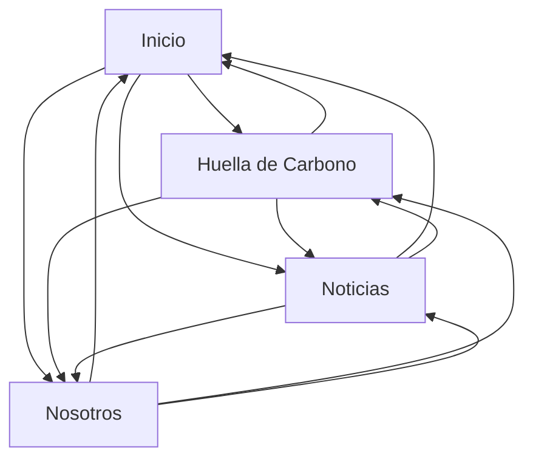

# The Blue Studio

Página web de un estudio de arquitectura desarrollada con HTML, CSS y JavaScript.

## Páginas maquetadas

* **Inicio (`index.html`)**: presentación de los proyectos actuales que son Horizonte, Elemental, Siliente y Tangente, además del header y footer.
* **Huella de Carbono (`huellaDeCarbono.html`)**: información sobre la sostenibilidad que lleva la empresa, materiales y el proyecto Esencia, el cual es el mas sustentable que se ha creado.
* **Noticias (`noticias.html`)**: sección de noticias y proyectos.
* **Nosotros (`nosotros.html`)**: información del estudio y sección de cifras destacadas.

## Componentes creados

* Header con navegación.
* Footer con links (no funcionales) a redes sociales, información legal e información de privacidad.
* Secciones de proyectos con imágenes y títulos.
* Bloques de noticias mediante el uso de Grid.
* Sección de cifras.
* Diseño responsive para adaptar la página a diferentes tamaños de pantalla.

## Interactividad (JavaScript)

Todas estas interacciones reaccionan al scroll o al tiempo, sin necesidad de clics. Cada script se ejecuta solo si encuentra en la página el elemento que necesita, así que un mismo archivo (`header.js`) funciona en las cuatro páginas.

### Header inteligente (`js/header.js`)

**Dónde:** En las cuatro páginas.

**Qué hace:**
* Al bajar la página, el header se esconde (se desplaza hacia arriba); al subir, reaparece.
* Al llegar arriba del todo, el header vuelve a ser transparente; en cualquier otro punto, toma un fondo semitransparente con desenfoque para que el texto se lea sobre las imágenes.
* Mide su propio alto en cada momento y ajusta el espacio del contenido de la página para que nada quede tapado.

### Carrusel de proyectos (`js/casas.js`)

**Dónde:** Solo en Inicio.

**Qué hace:** en vez de tener botones de "siguiente", el carrusel avanza según cuánto se ha bajado dentro de su sección. Se calcula un progreso de 0 a 1 con la posición de scroll, y ese progreso decide qué foto y qué punto se marcan como activos.

### Animación de la casa Esencia (`js/esencia.js`)

**Dónde:** Solo en Huella de Carbono.

**Qué hace:** dentro de una sección fija en pantalla (`position: sticky`), el scroll mueve la imagen de la casa hacia un lado y hace aparecer el texto desde el lado contrario.

### Contador animado (`js/contador.js`)

**Dónde:** Solo en Huella de Carbono.

**Qué hace:** el número de kilos de materiales reciclados no aparece fijo, sino que:
1. Sube desde 0 hasta el valor actual con una animación que desacelera al acercarse al final. Importante que esta funcion podría funcionar jalando los datos de una api funcional, por lo que para este proyecto solo es representativo.
2. Una vez llegando al límite fijado, cada pocos segundos suma una pequeña cantidad, simulando que los datos se van actualizando.

## Pendiente / por confirmar

* De los bloques pendientes solo fue en la seccion de casas, no era responsivo y se rompía en ciertos puntos. Agregando el carrusel vertical se solucionó.

## Cambios

* Se agregaron apartados de información en las páginas Huella de Carbono y Nosotros.
* Se añadió interactividad con JavaScript: header que se esconde al hacer scroll, carrusel de proyectos controlado por scroll, animación de la sección Esencia y contador animado de materiales reciclados.

## Navegación

