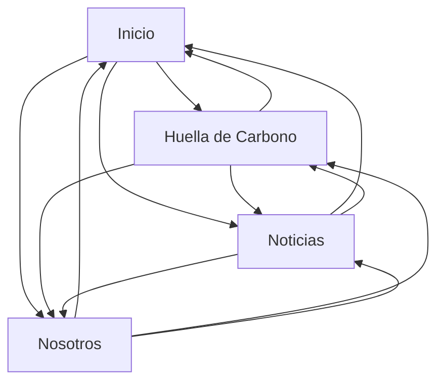

# The Blue Studio

Página web de un estudio de arquitectura desarrollada con HTML, CSS y JavaScript, sin librerías.

> **Importante sobre Netlify:** la cuenta de Netlify se quedó sin créditos. El sitio sigue en línea en [elestudioazul.netlify.app](https://elestudioazul.netlify.app), pero los despliegues a producción están pausados, así que el enlace puede mostrar una versión anterior a la entregada. Para ver la versión final, abrir `index.html` de la carpeta entregada en cualquier navegador.

## Páginas maquetadas

* **Inicio (`index.html`)**: presentación de los proyectos actuales, que son Horizonte, Elemental, Siliente y Tangente, además del header y footer.
* **Huella de Carbono (`huellaDeCarbono.html`)**: información sobre la sostenibilidad de la empresa, los materiales y el proyecto Esencia, el más sustentable que se ha creado.
* **Noticias (`noticias.html`)**: sección de noticias y proyectos.
* **Nosotros (`nosotros.html`)**: información del estudio y sección de cifras destacadas.

## Componentes creados

* Header con navegación.
* Footer con links (no funcionales) a redes sociales, información legal e información de privacidad.
* Secciones de proyectos con imágenes y títulos.
* Bloques de noticias mediante el uso de Grid. En celular alternan imagen y texto.
* Sección de cifras.
* Diseño responsive para adaptar la página a diferentes tamaños de pantalla. Los cambios principales de diseño ocurren en 800px, 700px y 500px de ancho.

## Interactividad (JavaScript)

Todas estas interacciones reaccionan al scroll o al tiempo, sin necesidad de clics. Cada página carga solo los scripts que necesita. `header.js` se usa en las cuatro páginas y revisa si existe el carrusel antes de ajustarlo, porque el carrusel solo está en Inicio.

### Header inteligente (`js/header.js`)

**Dónde:** En las cuatro páginas.

**Qué hace:**
* Al bajar la página, el header se esconde (se desplaza hacia arriba); al subir, reaparece.
* Al llegar arriba del todo, el header vuelve a ser transparente; en cualquier otro punto, toma un fondo semitransparente con desenfoque para que el texto se lea sobre las imágenes.
* Mide su propio alto en cada momento y ajusta el espacio del contenido de la página para que nada quede tapado.

### Carrusel de proyectos (`js/casas.js`)

**Dónde:** Solo en Inicio.

**Qué hace:** en vez de tener botones de "siguiente", el carrusel avanza según cuánto se ha bajado dentro de su sección. Se calcula un progreso de 0 a 1 con la posición de scroll, y ese progreso decide qué foto y qué punto se marcan como activos.

### Animación de la casa Esencia (`js/esencia.js`)

**Dónde:** Solo en Huella de Carbono.

**Qué hace:**
* **En computadora:** dentro de una sección fija en pantalla (`position: sticky`), el scroll mueve la imagen de la casa hacia la izquierda y hace aparecer el texto a la derecha, subiendo desde abajo.
* **En celular (800px o menos):** el título, el texto y la casa se acomodan en columna. La casa no se mueve, para que no se corte, y el texto aparece mientras la sección entra a la pantalla.

### Contador animado (`js/contador.js`)

**Dónde:** Solo en Huella de Carbono.

**Qué hace:** el número de kilos de materiales reciclados no aparece fijo, sino que:
1. Sube desde 0 hasta 9,922 kg con una animación que desacelera al acercarse al final. Esta función podría tomar los datos de una API real; en este proyecto el número solo es representativo.
2. Una vez que llega al límite fijado, cada 3 segundos suma una pequeña cantidad y el número se pinta de azul por un momento, simulando que los datos se van actualizando.

El número se muestra con coma de miles (por ejemplo, 9,922 kg).

## Pendiente 

* El único bloque pendiente era la sección de casas en Inicio: no era responsiva y se rompía en ciertos puntos. Se solucionó agregando el carrusel vertical.
* La sección de Casa Esencia se veía mal en celular y en laptops con pantallas bajitas. 

## Cambios

* Se agregaron apartados de información en las páginas Huella de Carbono y Nosotros.
* Se añadió interactividad con JavaScript: header que se esconde al hacer scroll, carrusel de proyectos controlado por scroll, animación de la sección Esencia y contador animado de materiales reciclados.
* **Revisión final:**
  * Casa Esencia: en celular ya no queda un hueco en blanco ni se mueve la página de lado, y en laptops bajitas el título y el texto ya no se enciman.
  * Se recortó la franja transparente de `casaEsencia.png`, que hacía ver la casa corrida a la izquierda.
  * El contador muestra el número con coma y el destello azul en cada aumento.
  * Noticias alterna imagen y texto en celular.
  * Se quitaron reglas de CSS repetidas o sin efecto. No se usa ningún `!important`.

## Navegación

